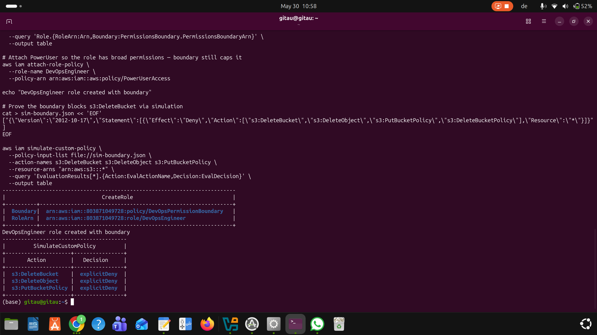

# Capstone-9: Enterprise-Grade Secure Cloud Platform on AWS

## Repository Structure

```
capstone-9/
├── .github/
│   └── workflows/
│       └── deploy.yml                          # OIDC CI/CD — no static keys
├── iam/
│   ├── permission-boundary.json                # Caps DevOps role permissions
│   ├── github-oidc-trust.json                  # OIDC trust policy (repo-scoped)
│   └── devops-role-policy.json                 # Deployment permissions
├── governance/
│   ├── scp-production-guardrails.json          # Deny EC2 terminate + CloudTrail
│   └── scp-deny-leave-org.json                 # Deny leaving organization
├── compliance/
│   ├── s3-encryption-config-rule.json          # Config managed rule
│   └── eventbridge-high-severity-rule.json     # Routes findings to SNS
├── app-security/
│   ├── waf-web-acl-rules.json                  # WAF rules reference
│   └── test-waf-attacks.sh                     # Attack simulation script
├── encryption/
│   ├── kms-key-policy.json                     # CMK key policy
│   └── s3-bucket-encryption.json               # Bucket encryption config
├── incident-response/
│   ├── stepfunctions-definition.json           # State machine definition
│   └── isolate-instance-lambda.py              # EC2 isolation Lambda
└── screenshots/                                # Evidence screenshots
    ├── module2.png                             # Module 2 — OIDC
    ├── Screenshot From 2026-05-30 10-56-16.png # Module 4 — Config recorder
    ├── Screenshot From 2026-05-30 12-13-29.png # Module 4 — Security Hub
    ├── Screenshot From 2026-05-30 12-50-03.png # Module 4 — Config rules
    ├── Screenshot From 2026-05-30 12-51-59.png # Module 4 — EventBridge + SNS
    ├── Screenshot From 2026-05-30 12-54-18.png # Module 4 — Remediation role
    ├── Screenshot From 2026-05-30 12-55-46.png # Module 4 — Auto-remediation
    ├── Screenshot From 2026-05-30 13-04-24.png # Module 4 — Before remediation
    ├── Screenshot From 2026-05-30 17-27-22.png # Module 5 — EC2 + ALB
    ├── Screenshot From 2026-05-30 17-29-15.png # Module 5 — WAF associated
    ├── Screenshot From 2026-05-30 17-30-33.png # Module 5 — WAF logging
    ├── Screenshot From 2026-05-30 17-33-14.png # Module 5 — SQLi blocked
    ├── Screenshot From 2026-05-30 17-33-54.png # Module 5 — XSS blocked
    ├── Screenshot From 2026-05-30 17-34-21.png # Module 5 — Rate limit
    ├── Screenshot From 2026-05-30 17-37-01.png # Module 5 — CloudWatch metrics
    ├── Screenshot From 2026-05-30 17-50-07.png # Module 5 — ALB healthy
    ├── Screenshot From 2026-05-30 17-55-06.png # Module 5 — Final validation
    ├── Screenshot From 2026-05-30 17-57-35.png # Module 7 — GuardDuty findings
    ├── Screenshot From 2026-05-30 18-05-35.png # Module 6 — KMS CMK
    ├── Screenshot From 2026-05-30 18-06-54.png # Module 6 — S3 aws:kms
    ├── Screenshot From 2026-05-30 18-16-49.png # Module 6 — HTTPS listener
    └── Screenshot From 2026-05-30 18-26-06.png # Module 6 — HTTP redirect
```
---

## Architecture---

## Modules Completed

| # | Module | Key Services | Status |
|---|--------|-------------|--------|
| 1 | Multi-Account Governance | Organizations, SCPs, CloudTrail | ✅ |
| 2 | IAM Zero-Trust + OIDC | Permission Boundaries, GitHub OIDC | ✅ |
| 3 | Automated Incident Response | GuardDuty, EventBridge, Step Functions, Lambda | ✅ |
| 4 | Continuous Compliance | AWS Config, Security Hub, Inspector | ✅ |
| 5 | Application Security | WAF Web ACL, ALB, Rate Limiting | ✅ |
| 6 | Full-Stack Encryption | KMS CMK (auto-rotation), ACM, HTTPS | ✅ |
| 7 | Attack Simulation | SQLi, XSS, Rate Limit, GuardDuty samples | ✅ |
| 8 | Executive Report | Architecture diagram, exam answers | ✅ |


## Evidence Screenshots

### Module 2 — IAM Zero-Trust + OIDC Federation




### Module 4 — Continuous Compliance


---

### Module 5 — Application Security (WAF + ALB)


---

### Module 6 — Full-Stack Encryption


